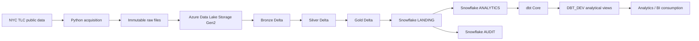

# UrbanFlow

**An end-to-end cloud data engineering platform for NYC taxi mobility analytics.**

UrbanFlow processes public New York City Taxi & Limousine Commission (TLC) data through a production-oriented lakehouse and warehouse architecture. It demonstrates reproducible acquisition, identity-based Azure storage access, Databricks and Delta Lake Medallion processing, transactional Snowflake loading, dbt modeling and testing, and evidence-driven reconciliation.

The project is complete and live-validated through its dbt analytics layer. It is a portfolio implementation—not a continuously scheduled production service—and it does not claim unimplemented orchestration, BI, CI/CD, or infrastructure automation.

## Overview

NYC TLC trip files are large, externally produced, and contain real-world quality anomalies. UrbanFlow turns one bounded monthly source period into traceable, analytics-ready datasets while preserving the original records and proving that each material boundary reconciles.

Key engineering outcomes:

- **4,090,836** Yellow Taxi trips processed from immutable source data to Snowflake and dbt.
- Bronze, Silver, and Gold Delta layers live-validated on Databricks Serverless with Unity Catalog.
- Deterministic trip keys, explicit schemas, structured rejection handling, and source lineage.
- Month-scoped replacement instead of blind append, with two-pass idempotency evidence.
- Transactional Snowflake loading across `LANDING`, `ANALYTICS`, and `AUDIT` schemas.
- A live-validated dbt project with **7 sources, 12 models, 95 tests, and 11 views**.
- **125 local pytest tests** plus Python compilation, dependency, whitespace, and artifact checks.

## Architecture



| Component | Implemented responsibility |
|---|---|
| Python acquisition | Downloads official TLC monthly Parquet and taxi-zone reference data with bounded streaming, atomic local publication, retry-safe behavior, and JSONL audit records. |
| ADLS Gen2 | Stores immutable raw objects and the Delta lake using Microsoft Entra identity through `DefaultAzureCredential`; no storage keys or SAS tokens are used. |
| Databricks + Delta Lake | Runs PySpark Bronze, Silver, and Gold workloads on Serverless compute with Unity Catalog access, ACID writes, schema controls, audit data, and bounded partition replacement. |
| Snowflake | Receives seven Gold contracts through `LANDING`, validates them, transactionally publishes them to `ANALYTICS`, and records load/reconciliation evidence in `AUDIT`. |
| dbt Core | Treats `ANALYTICS` as a read-only source and publishes tested staging and mart views to the separate `DBT_DEV` schema. |

For detailed system boundaries and trust transitions, see [docs/Architecture.md](docs/Architecture.md). Engineering decisions and physical contracts are documented in [docs/Design.md](docs/Design.md).

## Technology Stack

| Area | Technologies actually used |
|---|---|
| Languages | Python, SQL, PySpark |
| Cloud and storage | Microsoft Azure, Azure Data Lake Storage Gen2, Microsoft Entra ID, Azure Identity |
| Lakehouse | Azure Databricks Serverless, Unity Catalog, Delta Lake |
| Warehouse | Snowflake, Snowflake Spark connector, Snowflake Python connector |
| Analytics engineering | dbt Core, dbt-snowflake |
| Quality and development | pytest, Git, GitHub, PowerShell, Python virtual environments |

Azure Data Factory, Power BI, GitHub Actions, Docker, and infrastructure-as-code are **not** implemented components of the current project.

## Data Sources

- **Primary:** [NYC TLC Yellow Taxi Trip Records](https://www.nyc.gov/site/tlc/about/tlc-trip-record-data.page), processed for May 2026 during live validation.
- **Reference:** the official TLC Taxi Zone Lookup table.
- **Optional acquisition only:** NOAA/NCEI Climate Data Online observations. The client is implemented and token-gated, but weather is not part of the validated Bronze-to-dbt analytical model.

All project inputs are public datasets. UrbanFlow does not use private customer, patient, or production business data.

## End-to-End Data Flow

1. The Python acquisition layer constructs official source URLs, downloads to temporary files, and atomically renames completed files into local Bronze-oriented paths.
2. The ADLS uploader authenticates with `DefaultAzureCredential`, stages uploads in chunks, verifies size, and atomically renames them into immutable raw lake paths.
3. Bronze notebooks preserve source columns and add file, ingestion, run, and source-period metadata. Quality anomalies are reported without changing source records.
4. Silver applies explicit types, deterministic deduplication, reference-driven location validation, and structured multi-rule rejection while preserving lineage.
5. Gold retains one row per valid trip, adds conformed date/time/location dimensions and guarded analytical measures, and produces daily, hourly, and location aggregates.
6. Databricks writes the seven validated Gold contracts to Snowflake `LANDING`; validation gates run before transactional replacement in `ANALYTICS`.
7. dbt reads `ANALYTICS`, builds thin staging interfaces and BI-oriented marts in `DBT_DEV`, executes 95 tests, and generates lineage/documentation artifacts outside the repository.

## Medallion Architecture

### Bronze — source fidelity and traceability

- Preserves the raw/near-raw TLC representation; quality findings do not filter or correct records.
- Records Unity Catalog-supported source metadata from `_metadata.file_path` plus UTC ingestion time and run ID.
- Replaces only the requested Yellow Taxi source-year/source-month partition; taxi zones use a small unpartitioned snapshot.
- Writes structured pipeline and quality audit evidence.

### Silver — conformance and explicit validity

- Produces typed, snake-case `fact_trips` and `dim_taxi_zones` contracts.
- Creates deterministic SHA-256 `trip_id` values because the TLC source has no stable trip identifier.
- Checks chronology, required values, finite numeric values, location references, and duplicates.
- Retains rejected records with all failed rules and the original uncast Bronze record as JSON; no record is silently discarded.
- Preserves finite negative monetary values as identified financial adjustments and null passenger counts as analytically unknown.

### Gold — analytical facts, dimensions, and aggregates

- Publishes `fact_trips` at one valid Silver trip per row.
- Builds `dim_date`, `dim_time`, and `dim_location` with deterministic keys.
- Adds guarded duration, speed, fare-per-mile, and tip-percentage calculations that cannot emit infinity or NaN.
- Publishes governed daily, hourly, and location aggregate contracts.

The separation keeps recovery and source evidence independent from business validity and analytical presentation.

## Snowflake Warehouse

```text
URBANFLOW
├── LANDING    temporary validated transfer boundary
├── ANALYTICS  seven governed fact/dimension/aggregate tables
└── AUDIT      load and reconciliation evidence
```

Databricks transfers the Gold Delta contracts with key-pair authentication and the Snowflake Spark connector's internally managed staging. Facts and aggregates replace only the requested `source_year` / `source_month`; dimensions use deterministic full snapshots. Each target change runs inside an explicit transaction (`BEGIN`, scoped `DELETE`, `INSERT`, `COMMIT`) and rolls back on failure.

The completed two-pass workflow validated source, landing, and target counts; keys; boundaries; all pickup/drop-off dimension relationships; aggregate totals; and audit completeness. It did not create an ADLS external stage or introduce Azure storage credentials.
## dbt Transformation Layer

`URBANFLOW.ANALYTICS` is the governed, read-only upstream source. `URBANFLOW.DBT_DEV` is the separate development target for dbt-created relations.

```text
7 ANALYTICS sources
    └── 7 stg_* views
          ├── int_trip_enriched (ephemeral)
          │     └── mart_trip_details (view)
          └── governed aggregate staging views
                ├── mart_daily_mobility (view)
                ├── mart_hourly_mobility (view)
                └── mart_location_mobility (view)
```

The seven sources are `fact_trips`, `dim_date`, `dim_time`, `dim_location`, `agg_daily`, `agg_location`, and `agg_hourly`. Staging models expose explicit lower-case contracts without changing grain or measures. `int_trip_enriched` centralizes six pickup/drop-off role-playing dimension joins and remains ephemeral to avoid persisting another 4.09-million-row fact copy. Aggregate marts add descriptive attributes while reusing the authoritative Phase 7 measures.

Controlled validation completed `dbt debug`, `dbt parse`, `dbt build`, standalone `dbt test`, live relation validation, Phase 7 reconciliation, and `dbt docs generate`. See [dbt/README.md](dbt/README.md) for safe external configuration.

## Data Quality & Reliability

UrbanFlow makes quality observable at the earliest useful layer:

- acquisition checks HTTP/file behavior and records completed, skipped, and failed attempts;
- Bronze validates required schema, non-empty input, persisted counts, partitions, and report-only source anomalies;
- Silver validates types, required fields, chronology, numeric validity, deterministic duplicates, and taxi-zone relationships, with structured quarantine;
- Gold validates keys, dimensions, derived metrics, fact cardinality, and all aggregate perspectives;
- Snowflake validates landing schemas, counts, keys, source boundaries, relationships, transactions, audits, and two-pass idempotency;
- dbt tests nullability, uniqueness, accepted values, relationships, row preservation, mart keys, and focused business rules.

Warnings deliberately distinguish real-source observations from pipeline failures. The validated TLC batch retained negative financial adjustments and unknown passenger counts rather than manufacturing cleaner data by discarding them.

### Idempotency and reconciliation

The recovery boundary is the source period: `source_year` and `source_month`. Reprocessing a month replaces that bounded Delta/Snowflake slice instead of appending duplicates. Small reference dimensions are rebuilt as deterministic snapshots.

Idempotency was exercised with repeated Databricks writes and two complete Snowflake loading passes sharing one run identifier. Every dataset produced one stable target count. Forty Phase 7 reconciliation checks passed, and dbt staging/mart counts plus daily, hourly, and location measures matched their governed sources with zero differences.

## Security

- Azure access uses `DefaultAzureCredential` locally and managed-identity-backed Unity Catalog storage access in Databricks.
- Snowflake uses RSA key-pair authentication; the private key is stored outside the repository and supplied through approved external runtime configuration.
- dbt uses an external `profiles.yml` and environment variables; no repository-local populated profile is required or tracked.
- `ANALYTICS` and `DBT_DEV` remain separate, and the Phase 8 query-history check found zero mutations to `ANALYTICS`.
- No storage keys, SAS tokens, passwords, PATs, connection strings, populated `.env` files, private keys, or raw datasets are committed.
- Generated dbt targets, logs, packages, and documentation artifacts are ignored or generated outside the repository.

This is a portfolio security design with validated secret-handling boundaries; it is not presented as a complete enterprise IAM or governance implementation.

## Validation & Results

### Live cloud evidence

| Contract | Validated rows/results |
|---|---:|
| Trip fact / trip-detail mart | 4,090,836 |
| Date dimension | 6,363 |
| Time dimension (minute grain) | 1,440 |
| Location dimension | 265 |
| Daily aggregate | 35 |
| Hourly aggregate | 748 |
| Location aggregate | 265 |
| Phase 7 reconciliation checks | 40 passed, 0 failed |
| dbt sources / models / tests | 7 / 12 / 95 |
| dbt target relations | 11 views in `DBT_DEV`; 1 intermediate model ephemeral |
| dbt build | 106/106 resources completed |
| Standalone dbt tests | 95/95 passed |

Bronze preserved **4,090,836 of 4,090,836** trip rows and **265 of 265** taxi-zone rows. Silver produced the same valid counts with zero rejected rows for the validated period. Gold and Snowflake reconciled all fact, dimension, and aggregate contracts. The final dbt layer matched Phase 7 counts and aggregate measures exactly.

The repository's complete local suite currently passes **125 pytest tests**. Python compilation checks, `pip check`, `git diff --check`, secret/artifact scans, and exclusions for raw data and generated dbt files also passed during final validation.

## Project Phases

| Phase | Outcome | Status |
|---:|---|---|
| 1 | Repository foundation, requirements, engineering rules, and architecture | Complete |
| 2 | Real TLC/taxi-zone acquisition plus optional NOAA client | Complete |
| 3 | Identity-authenticated ADLS Gen2 upload and live object verification | Complete |
| 4 | Databricks Bronze Delta, metadata, audit, and observational quality | Complete and live-validated |
| 5 | Silver conformance, deterministic keys, quarantine, and reconciliation | Complete and live-validated |
| 6 | Gold fact, dimensions, aggregates, quality, and idempotency | Complete and live-validated |
| 7 | Transactional Snowflake loading, audit, reconciliation, and two-pass validation | Complete and live-validated |
| 8 | dbt sources, staging, intermediate, marts, tests, docs, and reconciliation | Complete and live-validated |
| 9 | Productionization review and scope finalization | Deferred / scope finalized |

Azure Data Factory was evaluated as a potential orchestration layer and intentionally deferred. The core portfolio objective is already demonstrated through Python, ADLS Gen2, Databricks, Snowflake, and dbt; ADF would currently add deployment, permissions, and recurring cloud-operation scope without materially expanding the demonstrated transformation, reliability, or analytical-modeling capabilities. UrbanFlow therefore makes no claim that an ADF factory, pipeline, or trigger exists.

## Repository Structure

```text
urbanflow/
├── src/
│   ├── ingestion/          # TLC/NOAA acquisition and local audit logic
│   └── azure_storage/      # Identity-based ADLS upload client
├── notebooks/
│   ├── bronze/             # Source-preserving Delta ingestion
│   ├── silver/             # Typed facts, zones, and rejection handling
│   ├── gold/               # Facts, dimensions, aggregates, and quality
│   ├── snowflake/          # Landing, transactional load, audit, reconciliation
│   └── utilities/          # Reusable PySpark/Snowflake contracts
├── sql/snowflake/          # Explicit Phase 7 warehouse DDL
├── dbt/                    # Sources, staging, intermediate, marts, tests, docs
├── tests/                  # PySpark-free unit and contract tests
├── docs/                   # Architecture, design, requirements, rules, decisions
├── data/                   # Ignored local runtime data; only a marker is tracked
├── .env.example            # Blank/safe configuration contract
└── pyproject.toml          # Python package and test configuration
```

## Getting Started

### Local development

```powershell
python -m venv .venv
.\.venv\Scripts\Activate.ps1
python -m pip install -r requirements.txt
pytest -q
```

Use `.env.example` as the configuration reference. Keep populated values in process environment variables or an ignored local `.env`; never commit credentials.

Acquire public data for the configured month:

```powershell
python -m src.ingestion.run_ingestion --source tlc
python -m src.ingestion.run_ingestion --source taxi-zones
# Optional and token-gated:
python -m src.ingestion.run_ingestion --source weather
```

After Azure CLI authentication and approval to use the existing ADLS resources:

```powershell
python -m src.azure_storage.uploader --source all
```

Existing same-size remote files are skipped; conflicts require deliberate `--overwrite`. Runtime outputs under `data/` are ignored.

### Validated cloud components

The Databricks, Snowflake, and dbt workflows require pre-existing external resources, permissions, and secret configuration. This repository contains notebooks, SQL, models, tests, and safe examples; it does **not** automatically provision the validated cloud environment.

For dbt, provide the eight `DBT_*` variables documented in `.env.example`, keep the populated profile outside the repository, select `DBT_DEV`, and run from `dbt/` only after Snowflake access is approved:

```powershell
dbt debug
dbt parse
dbt build
dbt test
dbt docs generate
```

Do not target or mutate `URBANFLOW.ANALYTICS` with dbt. Detailed prerequisites and phase evidence are in [docs/Phases.md](docs/Phases.md) and [dbt/README.md](dbt/README.md).

## Future Enhancements

The following are deliberately deferred and are not part of the implemented architecture:

1. Azure Data Factory or another cloud-native orchestration/scheduling layer.
2. Power BI semantic model and portfolio dashboard.
3. Centralized operational telemetry, alerting, and runbooks.
4. CI/CD validation and controlled cloud deployment.
5. Automated, environment-specific cloud infrastructure provisioning.
6. Weather enrichment in Silver, Gold, Snowflake, and dbt models.
7. Production workload tuning, freshness SLAs, and cost monitoring.

## Project Status

**Core platform complete through Phase 8; Phase 9 scope finalized with ADF deferred.**

UrbanFlow has been validated end to end from public source acquisition through ADLS, Databricks Medallion layers, Snowflake, and dbt. Phase 10 has not started. No future service should be described as implemented until repository and live evidence exist.
